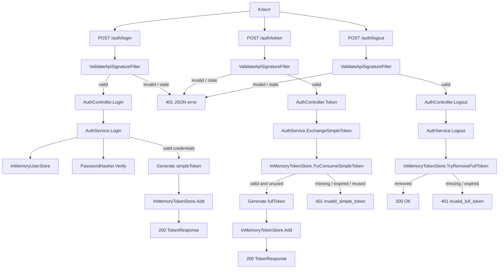
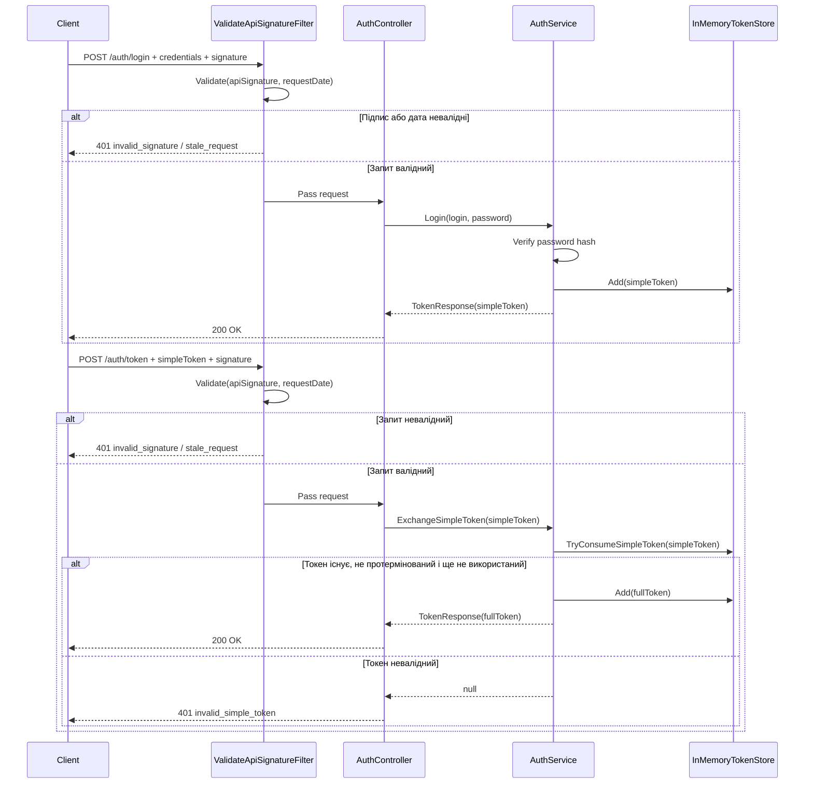
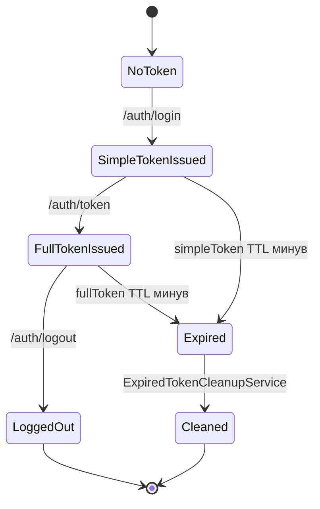

# SecureAuth: архітектурні нотатки

Це короткий технічний огляд проекту: як запит проходить через API, де лежить основна логіка і чому кілька речей зроблені саме так. Він не замінює код, але допомагає швидко зорієнтуватися перед читанням.

## Основний сценарій

## Послідовність login і token exchange

## Життєвий цикл токенів

## Карта файлів

### Точка входу

- `src/SecureAuth/Program.cs` - конфігурація DI, controllers, Swagger, обробка помилок і запуск API.

### HTTP API

- `src/SecureAuth/Controllers/AuthController.cs` - тонкий контролер для `/auth/login`, `/auth/token`, `/auth/logout`.
- `src/SecureAuth/Contracts/*` - DTO запитів, відповідей і єдиний формат помилок.
- `src/SecureAuth/Filters/ValidateApiSignatureAttribute.cs` - підключає фільтр до контролера.
- `src/SecureAuth/Filters/ValidateApiSignatureFilter.cs` - централізовано перевіряє підпис і freshness до бізнес-логіки.

### Бізнес-логіка

- `src/SecureAuth/Services/AuthService.cs` - координує login, обмін токена і logout.
- `src/SecureAuth/Services/ApiSignatureValidator.cs` - перевіряє `SHA-256(StaticKey + requestDate)` і часове вікно.
- `src/SecureAuth/Services/PasswordHasher.cs` - перевіряє PBKDF2-SHA256 hash пароля.
- `src/SecureAuth/Services/TokenGenerator.cs` - генерує криптографічно стійкі opaque-токени.

### Сховище

- `src/SecureAuth/Storage/InMemoryUserStore.cs` - завантажує demo-користувачів із конфігурації.
- `src/SecureAuth/Storage/InMemoryTokenStore.cs` - thread-safe сховище simple/full токенів.
- `src/SecureAuth/Background/ExpiredTokenCleanupService.cs` - періодично видаляє протерміновані токени.

### Конфігурація і тести

- `src/SecureAuth/appsettings.json` - demo `StaticKey`, TTL і seed-користувач.
- `src/SecureAuth/SecureAuth.http` - ручні HTTP-приклади.
- `test/SecureAuth.Tests/*` - unit та integration tests для ключових сценаріїв.

## Чому підпис винесений у filter

Підпис і freshness тут працюють як захист входу в API, а не як частина login-логіки. Тому `AuthController` і `AuthService` не дублюють перевірку в кожному методі: filter запускається перед action-методом і блокує невалідні запити ще до бізнес-логіки.

## Чому `simpleToken` одноразовий

`simpleToken` існує тільки для короткого проміжного кроку. `InMemoryTokenStore.TryConsumeSimpleToken(...)` не просто читає його, а видаляє атомарно. Через це повторний обмін того самого `simpleToken` неможливий навіть при паралельних запитах.
