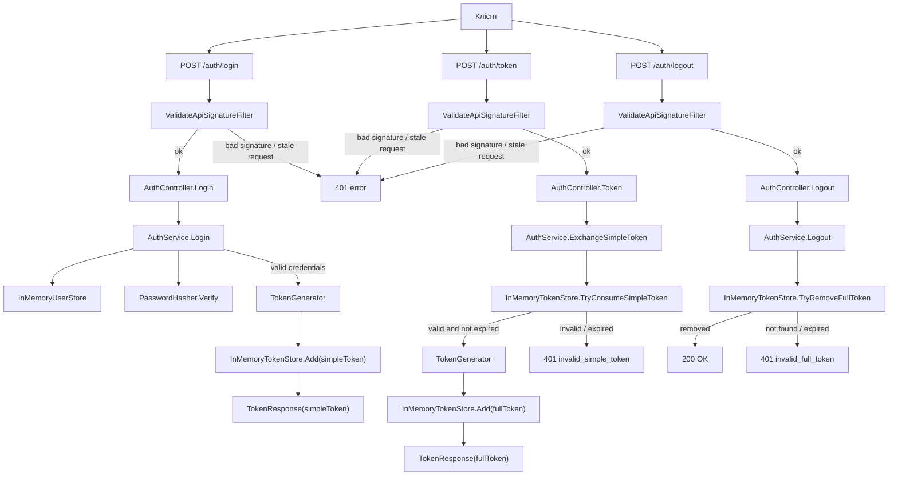
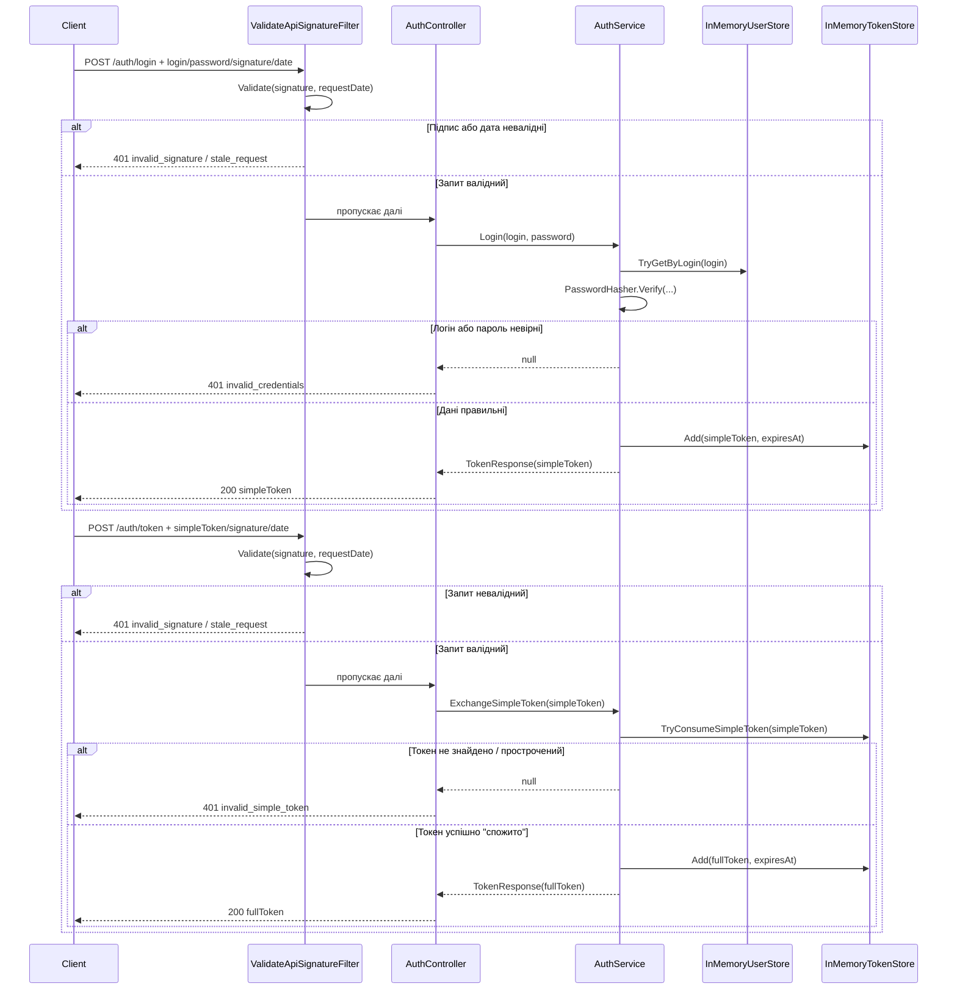
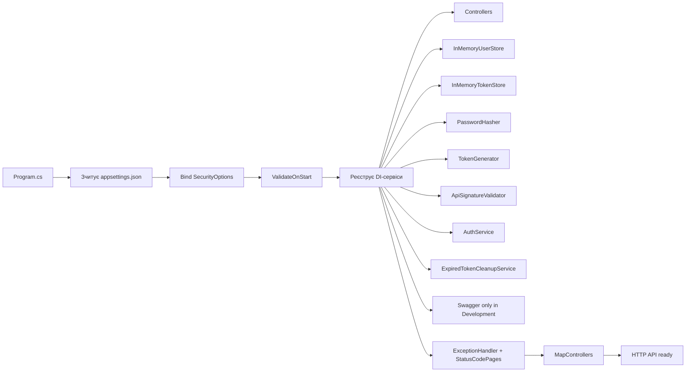
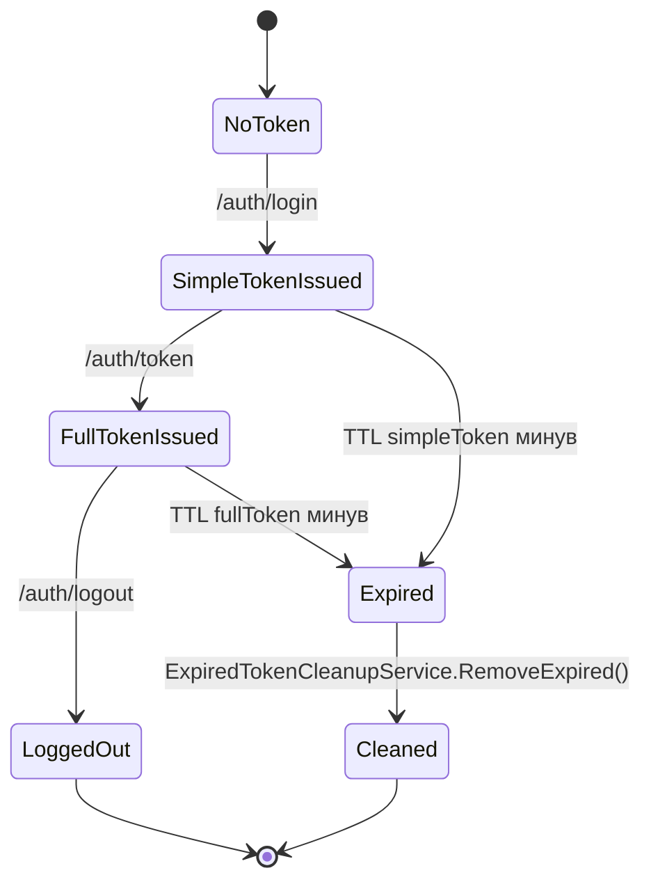

# SecureAuth: діаграми та карта файлів

Цей документ пояснює проєкт без потреби читати весь код.
Якщо коротко: це невеликий ASP.NET Core API для двоетапної авторизації.

## 1. Що робить програма

Клієнт не отримує "повний" токен одразу.
Спочатку він:

1. логіниться через `POST /auth/login`
2. отримує короткоживучий `simpleToken`
3. міняє його через `POST /auth/token`
4. отримує довгоживучий `fullToken`
5. може завершити сесію через `POST /auth/logout`

Усі запити на `/auth/*` мають містити:

- `apiSignature`
- `requestDate`

Сервер спочатку перевіряє підпис і "свіжість" запиту, і лише потім пускає його в бізнес-логіку.

## 2. Головна діаграма роботи

## 3. Послідовність для одного користувача

## 4. Запуск застосунку

## 5. Життєвий цикл токенів

## 6. Хто за що відповідає

### Точка входу

- `Program.cs`
  Налаштовує весь застосунок: конфігурацію, DI, контролери, Swagger, глобальну обробку помилок і background service.

### Конфігурація

- `Config/SecurityOptions.cs`
  Описує секцію `Security` з `appsettings.json`: статичний ключ, TTL токенів, freshness window, seed-користувачів.

- `appsettings.json`
  Містить demo-конфігурацію: `StaticKey`, час життя токенів, інтервал очищення і demo-користувача.

### HTTP API

- `Controllers/AuthController.cs`
  Приймає HTTP-запити і повертає HTTP-відповіді. Сам майже не містить логіки.

- `Contracts/LoginRequest.cs`
  Тіло запиту для `/auth/login`.

- `Contracts/TokenRequest.cs`
  Тіло запиту для `/auth/token`.

- `Contracts/LogoutRequest.cs`
  Тіло запиту для `/auth/logout`.

- `Contracts/TokenResponse.cs`
  Успішна відповідь з токеном і датою завершення.

- `Contracts/ErrorResponse.cs`
  Єдиний формат помилок API.

- `Contracts/ISignedRequest.cs`
  Спільний контракт для всіх запитів, які повинні містити `apiSignature` і `requestDate`.

### Захист запитів

- `Filters/ValidateApiSignatureAttribute.cs`
  Фільтр, який запускається перед методами контролера.
  Він витягує `ISignedRequest`, перевіряє підпис і блокує запит ще до бізнес-логіки.

- `Services/ApiSignatureValidator.cs`
  Реально перевіряє:
  - чи `apiSignature` дорівнює `SHA-256(StaticKey + requestDate)`
  - чи `requestDate` достатньо близький до поточного UTC часу

### Бізнес-логіка авторизації

- `Services/AuthService.cs`
  Центральний orchestration-сервіс:
  - перевіряє логін/пароль
  - створює `simpleToken`
  - одноразово обмінює `simpleToken` на `fullToken`
  - видаляє `fullToken` під час logout

- `Services/PasswordHasher.cs`
  Перевіряє пароль через PBKDF2-SHA256.
  Хеш не генерує, а саме валідує введений пароль проти збереженого хешу.

- `Services/TokenGenerator.cs`
  Генерує випадкові opaque-токени через `RandomNumberGenerator`.

### Сховища в пам'яті

- `Storage/InMemoryUserStore.cs`
  Завантажує користувачів з `Security:SeedUsers` у пам'ять і шукає їх по login.

- `Storage/InMemoryTokenStore.cs`
  Тримає `simpleToken` і `fullToken` у `ConcurrentDictionary`.
  Уміє:
  - додати токен
  - одноразово спожити `simpleToken`
  - видалити `fullToken`
  - очистити прострочені токени

### Моделі

- `Models/UserRecord.cs`
  Дані користувача в пам'яті.

- `Models/StoredToken.cs`
  Дані токена: значення, тип, expiry.

- `Models/TokenKind.cs`
  Розрізняє `Simple` і `Full`.

### Фонові задачі

- `Background/ExpiredTokenCleanupService.cs`
  Раз на N хвилин проходиться по token store і видаляє прострочені токени.

### Допоміжні файли

- `SecureAuth.http`
  Готові приклади ручного тестування endpoint-ів.

- `Properties/launchSettings.json`
  Локальні профілі запуску Visual Studio / `dotnet run`.

## 7. Важливі технічні ідеї

### Чому фільтр стоїть окремо

Так автори відділили транспортний захист від бізнес-логіки.
`AuthController` і `AuthService` не перевіряють `apiSignature` вручну в кожному методі, бо це робить фільтр один раз централізовано.

### Чому `simpleToken` одноразовий

`InMemoryTokenStore.TryConsumeSimpleToken(...)` не просто читає токен, а видаляє його.
Тому один `simpleToken` не можна використати двічі.

### Чому тут немає бази даних

Усе зберігається в пам'яті:

- користувачі завантажуються з конфігу при старті
- токени живуть, поки живий процес

Якщо перезапустити застосунок, усі видані токени зникнуть.

## 8. Найкоротше пояснення "як воно працює"

1. `Program.cs` збирає API й реєструє всі сервіси.
2. Кожен запит на `/auth/*` спочатку проходить через `ValidateApiSignatureFilter`.
3. `AuthController` лише приймає DTO і викликає `AuthService`.
4. `AuthService` працює з користувачами, паролями й токенами.
5. `InMemoryTokenStore` зберігає токени в пам'яті.
6. `ExpiredTokenCleanupService` прибирає прострочені токени у фоні.

## 9. Якщо дивитися код лише в 5 файлах

Якщо ти хочеш зрозуміти проєкт максимально швидко, дивись у такому порядку:

1. `Program.cs`
2. `Controllers/AuthController.cs`
3. `Filters/ValidateApiSignatureAttribute.cs`
4. `Services/AuthService.cs`
5. `Storage/InMemoryTokenStore.cs`

Цього вже достатньо, щоб зрозуміти приблизно 90% поведінки програми.
